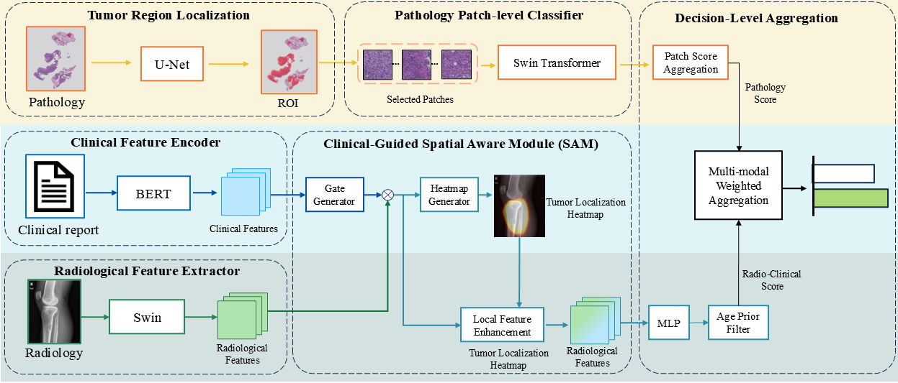

# Osteosarcoma Diagnosis System

## Title & Abstract

**Modality-adaptive artificial intelligence for osteosarcoma diagnosis**

This project presents a multi-modal deep learning system for classifying osteosarcoma (OS) and non-osteosarcoma (NOS) using:
- **DR (Digital Radiography) images** with clinical text metadata
- **Whole Slide Image (WSI) histopathological patches**

The system achieves robust performance through a dual-branch architecture: the **Radiology-Clinical Fusion Module** processes DR images with clinical text via a Swin Transformer + BERT fusion, while a separate **Swin Transformer** branch classifies WSI patches. A late fusion mechanism combines predictions from both branches.

> **System Architecture**:
> 

---

## Installation

### 1. Clone the Repository

```bash
git clone https://github.com/superpenh/Osteosarcoma_diagnosis_cleaned.git
cd Osteosarcoma_diagnosis_cleaned
```

### 2. Create Virtual Environment

```bash
# Using conda
conda create -n osteosarcoma python=3.9.18
conda activate osteosarcoma

# Or using venv
python -m venv venv
# Windows: .\venv\Scripts\activate
# Linux/Mac: source venv/bin/activate
```

### 3. Install Dependencies

```bash
pip install -r requirements.txt
```


### 4. Download Pretrained Weights

The model weights are available via this Baidu Cloud link: [https://pan.baidu.com/s/15G4WFGmLOH_ortMvYIQL_w?pwd=1cjz]

```
radiology/pretrained_weights/        # BERT model files
radiology/checkpoints/              # Radiology-Clinical Fusion model checkpoint
checkpoints/segmentation/segmentor/ # WSI segmentor checkpoint
checkpoints/classification/         # WSI patch classifier checkpoint
```

---

## Data Preparation

### Directory Structure

```
data/
├── DR_images/                  # DR radiography images
│   ├── OS/                    # Osteosarcoma patients
│   │   └── {patient_id}/
│   │       └── *.jpg/png      # DR images per patient
│   └── NOS/                   # Non-osteosarcoma patients
│       └── {patient_id}/
│           └── *.jpg/png
├── clinical_info/             # Clinical metadata
│   ├── OS.XLSX               # OS clinical data (性别, 年龄, 发病部位)
│   └── NOS.XLSX             # NOS clinical data
├── WSI_raw/                   # Raw whole slide images (input)
│   ├── OS/
│   │   └── {patient_id}/
│   │       └── *.svs/*.tif   # Original WSI files
│   └── NOS/
├── annotations/              # GeoJSON tumor region annotations (optional)
│   └── {patient_type}/
│       └── {patient_id}/
│           └── *.geojson

```

### Data Specifications

| Modality | Format | Specifications                       |
|----------|--------|--------------------------------------|
| DR Images | JPG/PNG | X-ray images                         |
| Clinical Text | XLSX | Columns: `gender`, `age`, `location` |
| WSI Raw | `.svs` / `.tif` | 40× magnification at 0.25 μm/pixel                  |
| Annotations | GeoJSON | Polygon regions for tumor areas      |

---

## Model Weights

Pretrained and final model weights can be downloaded from this Baidu Cloud link: [https://pan.baidu.com/s/15G4WFGmLOH_ortMvYIQL_w?pwd=1cjz]:

| Model | Path | Description |
|-------|------|-------------|
| Radiology-Clinical Fusion Model| `radiology/checkpoints/gating_with2loss/best_swin_model_epoch33_acc0.789_auc0.864.pth` | DR classification with clinical text |
| WSI Classifier | `checkpoints/classification/2fenlei/swin/best_2fenlei_epoch9_0.835.pth` | Swin Transformer for WSI patches |
| BERT | `radiology/pretrained_weights/` | Chinese clinical text encoder (bert-base-chinese) |

---

## Usage

> **Note:** All scripts use **hardcoded configuration classes** — edit the paths and hyperparameters in the respective `Options` / `Args` class before running. Scripts tagged with `TODO` require manual `--WSI_type`, `--anno_type`, and `--dset` flags to be set per run.

The pipeline consists of two phases: **training** (Steps 1–4) and **case-level inference** (Steps 5–9).

---

### Step 1: Generate Training Patches from Annotated WSIs

Uses pathologist-annotated GeoJSON tumor regions to extract labeled image patches and segmentation masks from raw WSI files.

**Input Data:**

```
{slides_dir}/                        # Raw WSI files
├── *.tif / *.svs

{annos_dir}/                         # GeoJSON annotations, one per slide
└── {slide_name}.geojson
```

**Code (run once per WSI type × annotation type × split combination):**

```bash
# Example: extract NOS tumor patches (Pos) for training set
python anno_parser/gen_patches_gurouliu_all.py \
    --WSI_type NOS --anno_type Pos --dset train \
    --slides_dir /path/to/NOS_slides \
    --annos_dir /path/to/annotations

# Extract OS tumor patches (Pos) for training set
python anno_parser/gen_patches_gurouliu_all.py \
    --WSI_type OS --anno_type Pos --dset train

# Extract non-tumor background patches (Neg) for training set
python anno_parser/gen_patches_gurouliu_all.py \
    --anno_type Neg --dset train

# Repeat with --dset test for the test split
```

- For each annotated polygon region, samples patches whose center falls inside the annotation
- Applies the annotation polygon as a binary mask (`255` = tumor, `155` = non-tumor)
- Crops patches at native resolution (`--crop_size 1024`) then resizes to `--save_size 256`

**Output Data:**

```
{output_dir}/classification/{dset}/
├── img/
│   ├── 1/                  # NOS tumor patches (WSI_type=NOS, anno_type=Pos)
│   │   └── {slide}_{region}_h{H}_w{W}.png
│   ├── 2/                  # OS tumor patches (WSI_type=OS, anno_type=Pos)
│   │   └── {slide}_{region}_h{H}_w{W}.png
│   └── 3/                  # Non-tumor background patches (anno_type=Neg)
│       └── {slide}_{region}_h{H}_w{W}.png
└── groundTruth/
    ├── 1/                  # NOS tumor masks (same filenames as img/1/)
    ├── 2/                  # OS tumor masks
    └── 3/                  # Background masks (value 155, treated as class 0)
```

> **Class mapping:** Folder `1` = NOS, Folder `2` = OS, Folder `3` = background (non-tumor).

---

### Step 2: Train UNet Segmentation Network

Trains a UNet to distinguish tumor regions (OS + NOS) from non-tumor background — i.e. a binary segmentation task grouping folders 1+2 vs. folder 3.

**Input Data:** Patches and masks from Step 1, organized as:

```
{data_path}/
├── train/
│   ├── img/{1,2,3}/         # RGB patch images
│   └── groundTruth/{1,2,3}/ # Grayscale masks
└── test/
    ├── img/{1,2,3}/
    └── groundTruth/{1,2,3}/
```

**Code:**

```bash
python segmentation/train2torch.py
```

- Binary UNet with class-weighted loss (background class weight 5.8 to counter imbalance)
- H&E stain color augmentation applied during training
- Configurable in `segmentation/opts.py`: `--data_path`, `--batch_size`, `--imSize`, `--epoch`, etc.

**Output Data:**

```
checkpoints/segmentation/segmentor/
└── checkpoint_{epoch}_dice_{dice}.pth                # UNet model checkpoints
```

---

### Step 3: Train WSI Patch Classifier (Swin Transformer)

Trains a Swin Transformer to classify individual WSI patches as OS vs. NOS. Only folders 1 (NOS) and 2 (OS) from Step 1 are used — background patches (folder 3) are excluded.

**Input Data:** Same directory structure as Step 2, but only `img/{1,2}/` are required:

```
{data_path}/
├── train/img/{1,2}/          # 1 = NOS, 2 = OS patches
└── test/img/{1,2}/
```

**Code:**

```bash
python classification/train_2fenlei_swin.py
```

- `swin_large_patch4_window7_224` pretrained on ImageNet-22k, fine-tuned for 2-class classification
- H&E stain augmentation, random flip, rotation, color jitter
- Differentiated LR: backbone 1e-5, classification head 1e-4

**Output Data:**

```
checkpoints/classification/2fenlei/swin/
└── best_2fenlei_epoch{N}_{acc:.3f}.pth
```

---

### Step 4: Train DR Radiology-Clinical Fusion Model

Trains the dual-branch DR + clinical text fusion model independently from the WSI pipeline.

**Input Data:**

```
{root_dir}/
├── OS/
│   ├── train/{patient_id}/*.jpg|png     # DR X-ray images (grayscale)
│   └── test/{patient_id}/*.jpg|png
└── NOS/
    ├── train/{patient_id}/*.jpg|png
    └── test/{patient_id}/*.jpg|png

data/临床信息/
├── OS.XLSX                     # Columns: gender, age, location
└── NOS.XLSX
```

**Code:**

```bash
python radiology/train_gating_with2loss.py
```

- **Radiology-Clinical Fusion Module:**
  - DR image branch: Swin Transformer (384×384 input) encodes the X-ray
  - Clinical text branch: frozen `bert-base-chinese` + trainable projection layer encodes gender, age, location into a 256-d vector
  - Spatial Aware Module (SAM): cross-attention between visual patch tokens and clinical text tokens
  - Gating mechanism learns to weight image vs. clinical features per sample
  - Dual loss: CrossEntropy + gate regularization
- DR images: square-cropped, converted to grayscale, resized to 384×384

**Output Data:**

```
radiology/checkpoints/gating_with2loss/
└── best_swin_model_epoch{N}_acc{:.3f}_auc{:.3f}.pth
```

---

### Step 5: Run Trained Segmentor on All Cases

At this point all training is complete. Now apply the trained UNet to every patient's WSI (both training and internal validation sets) to extract tumor patches for case-level evaluation.

**Input Data:** Raw WSI files per patient case.

**Code:**

```bash
python segmentation/seg_wsi_2torch.py
```

- Tiles each WSI into 256×256 patches, runs trained UNet from Step 2, samples top-50 tumor patches (score ≥ 0.9)
- Configurable in `segmentation/opts.py`: `--wsi_dir`, `--res_dir`, `--slide_level`, `--imSize`, etc.

**Output Data (per WSI):**

```
{res_dir}/{slide_name}/
├── {slide_name}_000_{x}_{y}.png   # Patch 0 (highest tumor score)
├── {slide_name}_001_{x}_{y}.png   # Patch 1
└── ...                            # Up to 50 patches, sorted by score descending
```


---

### Step 6: Integrate Data into Per-Patient Case Folders

Organize the outputs of Step 5 (WSI patches) together with DR images into a unified case-level directory for multi-modal inference:

```
{val_data_root}/
├── OS/
│   └── {patient_id}/
│       ├── *.jpg / *.png                    # DR X-ray images for this patient
│       └── {patch_subfolder}/               # WSI patches from Step 5
│           └── *.png
└── NOS/
    └── {patient_id}/
        ├── *.jpg / *.png
        └── {patch_subfolder}/
            └── *.png
```

> The `fusion_dr_patch_report_dataset.py` module (`OsteosarcomaDataset`) loads this structure: it scans each patient folder for DR images (any `.jpg/.png/.bmp` directly inside), a subfolder containing WSI patches, and matches the patient name against clinical Excel records.

---

### Step 7: Optimize DR Age Threshold

The DR branch aggregates predictions across multiple X-ray images per patient. To ensure clinical safety and integrate demographic priors, an age-based override rule is applied: when predictions across multiple images are mixed/inconsistent, a positive diagnosis is downgraded to negative only if the patient's age exceeds a specific threshold. This step grid-searches the optimal age cutoff.

**Code:**

```bash
python evaluation/fusion_chuanxing_best_age.py
```

- Grid search: age threshold from 10 to 90 (step 5), with fixed fusion weight = 0.25
- Reports AUC / Accuracy / Sensitivity / Specificity / F1 for each threshold

**Output:** Console-printed best age threshold and corresponding metrics.

---

### Step 8: Optimize Multi-Modal Fusion Weight

Grid-searches the late-fusion weight α that balances DR and WSI predictions:

$$\text{prob}_{\text{fusion}} = \alpha \cdot \text{prob}_{\text{DR}} + (1-\alpha) \cdot \text{prob}_{\text{WSI}}$$

**Code:**

```bash
python evaluation/fusion_chuanxing_best_weights.py
```

- Grid search: α from 0.00 to 1.00 (step 0.05)
- Can also evaluate a fixed weight via `args.fixed_dr_weight = 0.25`

**Output:**
- Console-printed best α and per-weight metrics
- `ddkg_swin_weight_performance.png` — AUC / Accuracy / F1 vs. weight curves
- `ddkg_swin_roc_comparison.png` — ROC curves for DR-only, WSI-only, and best fusion

---

### Step 9: Final Multi-Modal Fusion Evaluation

Runs the complete pipeline with the optimized age threshold and fusion weight, producing final metrics with 95% bootstrap confidence intervals.

**Code:**

```bash
python evaluation/fusion_chuanxing_95cl.py
```

- Loads the trained DR model (Step 4) and WSI classifier (Step 3) into `MultiModalFusionModel`
- Per-patient inference:
  - **DR branch**: runs all DR images through Radiology-Clinical Fusion Model, takes max positive-class probability across images. If predictions are inconsistent across different images, the positive diagnosis is downgraded to negative only when the patient's age exceeds the optimized threshold.
  - **WSI branch**: runs all patches through Swin, selects top-50 most confident, computes confidence-weighted average
  - **Late fusion**: weighted average of DR and WSI probabilities
- 1000-iteration bootstrap for 95% confidence intervals

**Output:** Console-printed metrics with 95% CI:

```
Accuracy  |  AUC  |  Sensitivity  |  Specificity  |  Precision  |  NPV  |  F1
----------|-------|---------------|---------------|-------------|-------|-----
0.XXX     | 0.XXX | 0.XXX         | 0.XXX         | 0.XXX       | 0.XXX | 0.XXX
(95% CI)  |  ...  |  ...          |  ...          |  ...        |  ...  |  ...
```
---

## Project Structure

```
.
├── anno_parser/                                 # Annotation processing utilities
│   ├── load_anno_gurouliu.py                    # Load GeoJSON annotation files
│   ├── overlay_anno_gurouliu.py                 # Overlay annotations on WSI for visualization
│   └── gen_patches_gurouliu_all.py              # Generate patches from annotated WSI regions
│
├── segmentation/                                # WSI tumor segmentation (UNet)
│   ├── seg_wsi_2torch.py                        # Main entry: extract tumor patches from raw WSI using UNet
│   ├── train2torch.py                           # UNet training script for tumor segmentation
│   ├── unet.py                                  # UNet model definition
│   ├── wsi_util.py                              # WSI loading, patch sampling, heatmap visualization utilities
│   ├── data_gen.py                              # DataLoader for UNet training (tumor/background)
│   ├── opts.py                                  # Hyperparameters for WSI segmentation
│   ├── data_generator/                          # Image preprocessing utilities for segmentation
│   └── ablation_random_select_patches.py        # Random patch selection for ablation on segmentation
│
├── classification/                              # WSI patch classification
│   ├── train_2fenlei_swin.py                    # Training script for Swin-based WSI patch classifier (2-class)
│   ├── train_with_concat.py                     # Training with clinical features concatenated to patches
│   ├── data_gen.py                              # DataLoader for WSI patches (train/test split)
│   ├── dataset_prompt.py                         # Dataset with H&E staining augmentation (color jitter)
│   ├── create_dataloader_prompt.py               # DataLoader factory with partial sampler support
│   ├── opts.py                                  # Hyperparameters for patch classifier
│   └── checkpoints/                             # WSI patch classifier checkpoints
│
├── radiology/                                   # DR image processing
│   ├── train_gating_with2loss.py                # Training script for Radiology-Clinical Fusion Module (RCF)
│   ├── dataset_loader.py                        # DRDataset class for loading DR images with annotations
│   └── checkpoints/                             # RCF model checkpoints
│
├── evaluation/                                    # Multi-modal fusion inference & evaluation
│   ├── fusion_dr_patch_report_dataset.py           # Dataset class for multi-modal fusion (DR + patches + clinical)
│   ├── fusion_chuanxing_95cl.py                     # Multi-modal fusion inference (main). Evaluates with 95% CI bootstrap
│   ├── fusion_chuanxing_95cl_timed.py               # Time-stamped variant of fusion inference (prospective cohort timing analysis)
│   ├── fusion_chuanxing_95cl_calibration.py         # Prediction calibration analysis (regression toward mean)
│   ├── fusion_chuanxing_95cl_subgroup_analysis.py   # Age-type-specific subgroup analysis
│   ├── fusion_chuanxing_95cl_subgroup_analysis_bone_type.py  # Bone-type-specific subgroup analysis
│   ├── fusion_chuanxing_best_weights.py              # Grid search for optimal DR/WSI fusion weight α (0.0–1.0, step 0.05)
│   ├── fusion_chuanxing_best_age.py                  # Grid search for optimal age threshold (10–90, step 5) in DR multi-image aggregation rule
│   ├── dr_clinical_sensitivity_oriented.py          # Sensitivity-oriented threshold analysis for DR+Clinical only
│   └── gradcam_radio.py                             # Grad-CAM visualization for DR branch explainability
│
├── ablation/                                    # Ablation experiments
│   ├── fusion_remove_clinical.py                # Fusion without clinical text branch
│   ├── fusion_remove_sam.py                     # Fusion without SAM (Spatial Aware Module)
│   ├── fusion_clinical_info_bianli.py           # Ablation: test all subsets of clinical fields (gender/age/location) for DR model
│   ├── fusion_wsi+clinical(concat).py           # WSI + clinical concat fusion variant
│   ├── DR_train_remove_sam.py                   # RCF training without SAM
│   ├── DR_train_remove_clinical.py              # RCF training without clinical text
│   ├── DR_train_clinical_info_bianli.py         # Ablation: test all subsets of clinical fields (gender/age/location) for DR model
│   ├── age_selection_move.py                    # Age-based selection bias analysis
│   └── dataset_loader.py                        # Ablation-specific dataset loader
```


## Acknowledgements

- Swin Transformer: [Microsoft/swin-transformer](https://github.com/microsoft/swin-transformer)
- BERT: [Google/bert-base-chinese](https://huggingface.co/bert-base-chinese)
